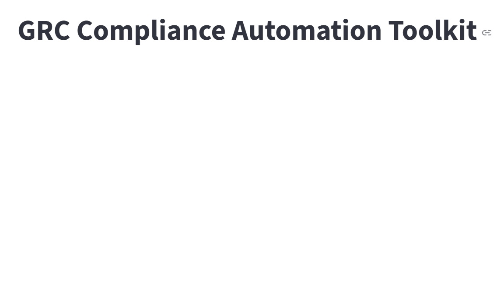

# GRC Compliance Automation Toolkit

A Python-based toolkit for automating Governance, Risk, and Compliance (GRC) workflows across healthcare and security frameworks.

This project automates:

- Control mapping across NIST, HIPAA, and HITRUST
- Regulatory detection (e.g., HIPAA 164.x references)
- Risk scoring and gap analysis
- HITRUST 06.c access control relevance analysis
- Interactive dashboard reporting

## Features
- Detects HIPAA references (e.g., 164.x)
- Maps controls across frameworks
- Scores controls and assigns risk levels
- Evaluates HITRUST 06.c relevance
- Streamlit dashboard for interactive analysis

## Installation

```bash
git clone https://github.com/GeoJordan/grc-python-toolkit.git
cd grc-python-toolkit
pip install -r requirements.txt
```

## Project Structure

```bash
grc-python-toolkit/
├── src/
├── data/
├── app.py
├── requirements.txt
├── README.md
└── .gitignore
```

## Business Value

Manual control mapping is often performed in spreadsheets, making audits slow and inconsistent.

This toolkit helps organizations:

- Improve audit readiness
- Reduce manual compliance effort
- Standardize control analysis
- Support healthcare security assessments


## How to Run

```bash
pip install -r requirements.txt
streamlit run app.py

## Dashboard Preview



Built by George Jordan using Python + GRC automation.